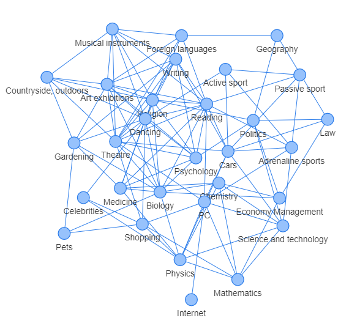
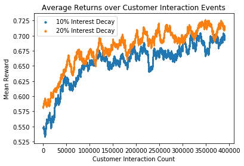

# Interest Recommender 
The aim of this project was to build a recommender system that is based on a DQN. Since I do not have access to a live webservice building an environment was a necessity. 
# Building an Environment:
To model realistic customers, a British youth survey was selected which asked 836 British teenagers to score 31 interests from one to five. Assuming the distribution to be gaussian a covariance matrix was extracted. Based on this realistically distributed customers can be sampled as needed. 
To add further realism, complexity and to distinguish the problem from a n-armed bandit problem, a short and a long term dynamic was introduced that modulate the interest of the customers. 

The short-term interest change was modelled to represent the customers decreasing interest from repeated recommendations of items belonging to the same categories. To achieve this a percentage of the interest level in a category given by a hyperparameter is subtracted each time a category is recommended. All other not recommended categories relax back to the baseline. This mechanic should ideally steer the agent into recommending not just the primary interest of the customer but also categories that are correlated. 
The second dynamic is a long-term permanent interest drift. To model this a kernel function was applied to all distances between each pair of points that represent customers in “customer space” the results were then normalized. This results in a n by n matrix, where n is the number of customers, where each column adds up to one. This can be interpreted as the transition probabilities from node to node of a fully connected graph. Based on this graph we can then model interest change as diffusion on that graph. Since adjacent points in customer space have a higher transition probability the diffusion dynamics are gradual rather than abrupt. 
# Markov Decision Process Formulation
Action: Recommendation of one of 31 interest categories.
State: The history of prior successful recommendations to each customer.
Reward: 1 if the customer buys the item or 0 if not. The purchasing probability is given by the customers interest in the recommended category. 
# Implementation Details
Since the actions of the model are discrete a DQN should work well in modelling the system. The DQN was implemented as fully connected neural network with an input size of the number of categories multiplied by the customer history window size. This window size is the number of last successful recommendations the model looks at when deciding to recommend the next item. The model has three hidden layers of size 100 and an output layer of size 31. Each layer was followed by a ReLU activation function and a batch normalization. The optimizer that was used was the Adam optimizer with weight decay and a learning rate of 0.001. The exploration rate stated of at 0.9 and was exponentially decreased to 0.05 during training. The discount factor gamma was set to 0.5, this is much lower than 1 due to the fact the system has no end state. All shown data was generated with a customer pool with the size of 400.

# Outlook 
An improvement to make the system more realistic is studying a more dynamic customer pool where new customers without a purchasing history replace old ones. Furthermore, the current model throws away past purchase information if it exceeds the input size of the neural network which is a non-ideal use of state information. This can potentially be remedied using a RNN or a 1-D CNN with padding. Further Hyperparameter study could also lead to improvements in model performance. 
